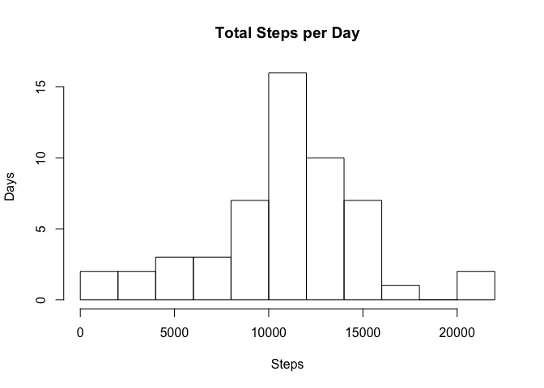
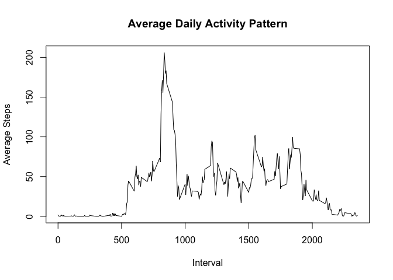
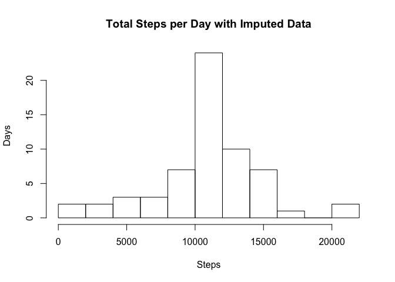
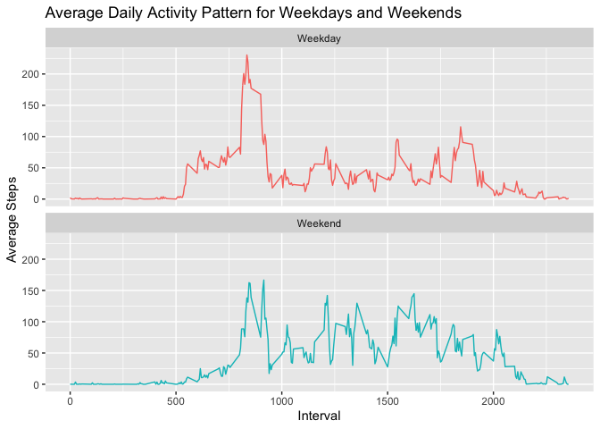

## Loading and preprocessing the data

As a start we unzip and load the data.


```r
unzip('activity.zip')
activity <- read.csv('activity.csv')
```


## What is mean total number of steps taken per day?

**1. Calculate the total number of steps taken per day.**


```r
stepsPerDay <- aggregate(steps ~ date, activity, sum, na.rm = TRUE)
```

**2. Make a histogram of the total number of steps taken each day.**


```r
hist(stepsPerDay$steps, main = "Total Steps per Day", xlab = "Steps", ylab = "Days", breaks = 10)
```

<!-- -->

**3. Calculate and report the mean and median of the total number of steps taken per day.**


```r
meanStepsPerDay <- mean(stepsPerDay$steps)
```

The mean number of steps taken per day is **10766**.


```r
medianStepsPerDay <- median(stepsPerDay$steps)
```

The median number of steps taken per day is **10765**.


## What is the average daily activity pattern?

**1. Make a time series plot (i.e. \color{red}{\verb|type = "l"|}type = "l") of the 5-minute interval (x-axis) and the average number of steps taken, averaged across all days (y-axis).**


```r
stepsPerInterval <- aggregate(steps ~ interval, activity, mean, na.rm = TRUE)
plot(steps ~ interval, stepsPerInterval, type="l", main = "Average Daily Activity Pattern", xlab = "Interval", ylab = "Average Steps")
```

<!-- -->

**2. Which 5-minute interval, on average across all the days in the dataset, contains the maximum number of steps?**


```r
maxInterval <- stepsPerInterval[which.max(stepsPerInterval$steps),]$interval
```

The 5-minute interval that on average contains the maximum number of steps is **835**.

## Imputing missing values

**1. Calculate and report the total number of missing values in the dataset (i.e. the total number of rows with \color{red}{\verb|NA|}NAs).**


```r
numNAs <- sum(!complete.cases(activity))
```

The number of rows with missing data is **2304**.

**2. Devise a strategy for filling in all of the missing values in the dataset. The strategy does not need to be sophisticated. For example, you could use the mean/median for that day, or the mean for that 5-minute interval, etc.**


```r
getMeanStepsPerInterval <- function(interval) {
    stepsPerInterval[stepsPerInterval$interval == interval, ]$steps
}
```


```r
activityNoNA <- activity

for (i in 1:nrow(activityNoNA)) {
        if (is.na(activityNoNA[i, ]$steps)) {
                activityNoNA[i, ]$steps <- getMeanStepsPerInterval(activityNoNA[i, ]$interval)
        }
}
```


The strategy for filling in the missing data was imputing the mean for the interval with the missing data.

**3. Create a new dataset that is equal to the original dataset but with the missing data filled in.**

The new dataset with the missing data filled in is in the variable **activityNoNA** (se code above).

**4. Make a histogram of the total number of steps taken each day and Calculate and report the mean and median total number of steps taken per day. Do these values differ from the estimates from the first part of the assignment? What is the impact of imputing missing data on the estimates of the total daily number of steps?**


```r
stepsPerDayNoNA <- aggregate(steps ~ date, activityNoNA, sum)
hist(stepsPerDayNoNA$steps, main = "Total Steps per Day with Imputed Data", xlab = "Steps", ylab = "Days", breaks = 10)
```

<!-- -->


```r
meanStepsPerDayNoNA <- mean(stepsPerDayNoNA$steps)
medianStepsPerDayNoNA <- median(stepsPerDayNoNA$steps)
```

With the imputed data the mean number of steps taken per day is **10766** and the median number of steps taken per day is **10766**.  

With the original data the mean number of steps taken per day was **10766** and the median number of steps taken per day is **10765**.  

We see no significant change to neither the mean nor the median when we impute the missing data.

Though there is no significant change to neither the mean nor the median the total number of steps is of course larger with the imputed data. 


## Are there differences in activity patterns between weekdays and weekends?

**1. Create a new factor variable in the dataset with two levels – “weekday” and “weekend” indicating whether a given date is a weekday or weekend day.**


```r
activityNoNA$date <- as.Date(strptime(activityNoNA$date, format="%Y-%m-%d"))
activityNoNA$datetype <- sapply(activityNoNA$date, function(x) {
        if (weekdays(x) == "Lørdag" | weekdays(x) =="Søndag") 
                {y <- "Weekend"} else 
                {y <- "Weekday"}
                y
        })
```

The new factor variable indicating whether a given day is a weekday or weekend day is called **datetype** and was added to the data frame **activityNoNA**.

**2. Make a panel plot containing a time series plot (i.e. \color{red}{\verb|type = "l"|}type = "l") of the 5-minute interval (x-axis) and the average number of steps taken, averaged across all weekday days or weekend days (y-axis). See the README file in the GitHub repository to seeknit2html() an example of what this plot should look like using simulated data.**


```r
newStepsPerDayNoNA <- aggregate(steps~interval + datetype, activityNoNA, mean, na.rm = TRUE)

library(ggplot2)

plot<- ggplot(newStepsPerDayNoNA, aes(x = interval , y = steps, color = datetype)) +
       geom_line(show.legend = FALSE) +
       labs(title = "Average Daily Activity Pattern for Weekdays and Weekends", x = "Interval", y = "Average Steps") +
       facet_wrap(~datetype, ncol = 1, nrow=2)
print(plot)
```

<!-- -->
